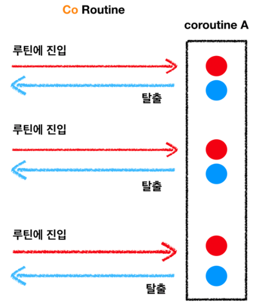

# 코루틴(Coroutine) 알고 사용하자


### 코루틴이란?

>1. **협력형 멀티 태스킹**
>2. 동시성 프로그래밍 지원
>3. 비동기 처리를 쉽게 도와줌
>
>으로 말할 수 있다. 여기서 말하는 협력형 멀티태스킹을 표현하자면
>
>Co + Routine 이다. **Co**라는 접두어는 “협력”, “함께”라는 의미를 지니고 있다. 
>
>**Routine**은 하나의 태스크, 함수 정도로 생각하면 된다. 즉 협력하는 함수다. 
>
>
>
>코루틴도 routine이기 때문에 하나의 함수로 생각하자. 
>
>그런데 이 함수에 진입할 수 있는 진입점도 여러개고, 함수를 빠져나갈 수 있는 탈출점도 여러개다. 
>
>즉, 코루틴 함수는 꼭 `return`문이나 마지막 닫는 괄호를 만나지 않더라도 언제든지 중간에 나갈 수 있고, 
>
>언제든지 다시 나갔던 그 지점으로 들어올 수 있다.

### 동시성 프로그래밍

>함수를 중간에 빠져나왔다가, 다른 함수에 진입하고, 다시 원점으로 돌아와 멈추었던 부분부터 다시 시작하는 이 특성은 동시성 프로그래밍을 가능하게 한다.
>
>동시성 프로그래밍의 개념을 잡고가자면, 병행성 프로그래밍과 완전히 다른 개념이다. 예를 들어 양쪽에 놓여진 두 개의 도화지에 사람 그림을 각자 그린다고 가정해보자.
>
>
>
>동시성 프로그래밍은 두개의 도화지를 번갈아 가면서 그리는 것인데 이 행위가 빨리 진행되어 동시에 그려지는 것 처럼 보이는 것이다.
>
>하지만 병행성 프로그래밍은 말 그대로 양쪽손에 팬을 들고 왼쪽과 오른쪽에 실제로 그림을 동시에 그리는 것이다.
>
>이러한 병행성 프로그래밍은 쓰레드를 점유하고 놓아주고를 반복하기 때문에 (CPU보다 쓰레드가 많을경우)
>
>컨텍스트 스위칭이 발생하는데 이 작업은 꽤 비용이 많이 드는 작업이다. 
>
>따라서 코루틴은 매 우 가벼운 쓰레드 정도로 이해하면 될 거 같다.

### 예시를 통한 코루틴 접하기

>```kotlin
>import kotlinx.coroutines.GlobalScope
>import kotlinx.coroutines.delay
>import kotlinx.coroutines.launch
>
>
>fun main(args: Array<String>) {
>    GlobalScope.launch {
>        delay(1000L)
>        println("World!")
>    }
>    println("Hello,")
>    Thread.sleep(2000L)
>}
>```
>
>위 예제는 메인 함수 안에서 GlobalScope.launch { } 코드블록을 이용하여 Hello, World! 를 출력하는 간단한 프로그램이다. 
>
>함수의 가장 마지막 라인에서 2초간 정지(Sleep)하는 코드가 쓰인 이유는 코드에서 우리가 사용한 GlobalScope.launch { } 라는 코드 블록의 특성과 관련이 있다.
>
>GlobalScope.launch {} 코드 블록은 사실 코루틴을 생성하기 위한 코루틴 빌더이며 이렇게 생성되어 실행되는 코루틴은 호출(실행) 스레드를 블록하지 않기 때문에 그대로 두면 메인 함수가 종료되고 메인 함수를 실행한 메인 스레드 역시 종료되어 프로그램이 끝나게 된다.
>
>이를 방지하기 위해 임의의 시간을 지정하여 지연 시킨다. 이렇게 스레드를 멈추는 역할을 수행하는 함수를 중단 함수(Blocking function) 이라고 한다.
>
>중단함수의 예로는 runBlocking{ } 블록을 사용하는 것이다.
>
>```kotlin
>fun main(args: Array<String>) {
>    GlobalScope.launch {
>        delay(1000L)
>        println("World!")
>    }
>    println("Hello,")
>    runBlocking {
>        delay(2000L)
>    }
>}
>```
>
>위의 예시와 같이 runBlocking을 통해 메인스레드가 종료되는 것을 막고있다.
>
>하지만 안드로이드에서는 메인스레드에서 runBloking을 걸어주면 일정 시간 이상 응답이 없는 경우
>
>ANR(Application Not Responding) 이 발생하여 앱을 강제 종료된다는 점을 유의해야 한다.
>
>이를 대체하기 위해 delay()라는 suspend() 함수를 사용하는 것이 더 자연스럽다. 
>
>```kotlin
>fun main(args: Array<String>) = runBlocking {
>    GlobalScope.launch {
>        delay(1000L)
>        println("World!")
>    }
>    println("Hello,")
>    delay(2000L)
>}
>```
>
>delay() 는 중단 함수이며 모든 중단 함수들은 코루틴 안에서만 호출될 수 있다는 제약이 있다.
>
>GlobalScope.launch{ } 코드블록에서 delay(1000L) 를 사용할 수 있었던 이유도 GlobalScope.launch{ } 가 주어진 코드블록을 수행하는 코루틴을 생성하는 코루틴 빌더이기 때문이다.
>
>여기서 delay() 방법도 마음에 드는 방법이 아니다. 그 이유는 얼마나 작업이 끝날지 모르는 상황이
>
>올 수 있기 때문이다. 따라서 이러한 문제를 해결하기 위해 Job() 인스턴스를 사용한다. 
>
>```kotlin
>fun main(args: Array<String>) = runBlocking {
>    val job = GlobalScope.launch {
>        delay(1000L)
>        println("World!")
>    }
>    println("Hello,")
>    job.join()
>}
>```
>
>job 객체에 join 하여 코루틴이 종료될 때까지 대기한 후 종료하게 된다. 
>
>하지만 실제 현업에서 여러 코루틴을 작업하기 위해서 job객체마다 join을 하는 것은 까다로운 일이다.
>
>따라서 등장한 것이 코루틴 SCOPE이다.

### coroutine scope

>모든 코루틴들은 각자의 스코프를 갖는다.
>
>runBlocking{ } 코루틴 빌더를 이용해 생성 된 코루틴 블록 안에서 launch{ } 코루틴 빌더를 이용하여 새로운 
>
>코루틴을 생성하면 현재 위치한 부모 코루틴에 join() 을 명시적으로 호출할 필요 없이 자식 코루틴들을 실행
>
>하고 종료될 때까지 대기 할 수 있다. 
>
>다만 **launch{}는 앞에 CoroutineScope가 생략 된 것인데 block 내부** **로직을 지연하여 실행시키기 때문에 즉각 시행 되는 것들에 비해 늦게 시작된다.** 
>
>```kotlin
>fun main(args: Array<String>) = runBlocking {
>    launch {
>        delay(1000L)
>        println("World!")
>    }
>    println("Hello,")
>}
>```

### coroutine context

>코루틴은 항상 특정 문맥에서 실행된다. 
>
>이때 어떤 문맥에서 코루틴을 실행할지는 디스패처가 결정한다.
>
>```kotlin
>fun main() = runBlocking<Unit> {
>    val jobs = arrayListOf<Job>()
>    jobs += launch(Dispatchers.Unconfined) { // main 스레드에서 작업
>        println("Unconfined:\t\t ${Thread.currentThread().name}")
>    }
>    jobs += launch(coroutineContext) { // 부모의 문맥, 여기서는 runBlocking의 문맥
>        println("coroutineContext:\t ${Thread.currentThread().name}")
>    }
>    jobs += launch(Dispatchers.Default) { // 디스패처의 기본값 1
>        println("Default:\t\t ${Thread.currentThread().name}")
>    }
>    jobs += launch(Dispatchers.IO) { // 입출력 중심의 문맥 2
>        println("IO:\t\t ${Thread.currentThread().name}")
>    }
>    jobs += launch { // 아무런 인자가 없을 때
>        println("main runBlocking: ${Thread.currentThread().name}")
>    }
>    jobs += launch(newSingleThreadContext("MyThread")) { // 새 스레드를 생성함 3
>        println("MyThread:\t\t ${Thread.currentThread().name}")
>    }
>    jobs.forEach { it.join() }
>}
>//
>Unconfined:		 main
>Default:		 DefaultDispatcher-worker-1
>IO:		 DefaultDispatcher-worker-2
>MyThread:		 MyThread
>coroutineContext:	 main
>main runBlocking: main
>
>```
>
>1) 기본문맥은 GlobalScope와 동일하게 공유된 백그라운드 스레드의 CommonPool에서 코루틴을 
>
>실행하도록 한다. 다시 말하면 스레드를 새로 생성하지 않고 기존에 있는 것을 사용한다.
>
>2) I/O 는 입출력 윛주의 동작을 하는 코드에 적합한 공유 풀이다. 소켓처리나 블로킹 동작이 많은 파일에 
>
>적합하다.
>
>3) 새 스레드를 생성하는 문맥인데 새 스레드를 만들기 때문에 비용이 많이 들고 더 이상 필요하지 않으면
>
>해체하거나 종료시켜야 한다. 

## Scope builder

>만일 어떤 코루틴들을 위한 사용자 정의 스코프가 필요한 경우가 있다면 coroutineScope{ } 빌더를 이용할 수 있다. 
>
>이 빌더를 통해 생성 된 코루틴은 모든 자식 코루틴들이 끝날때까지 종료되지 않는 스코프를 정의하는 코루틴 이다.
>
>예제로 계속 사용하고 있는 runBlocking{ } 빌더와 coroutineScope{ } 빌더가 무슨 차이가 있는지 궁금할 수 있다. 
>
>그 차이는 runBlocking{ } 과 달리 coroutineScope{ } 는 자식들의 종료를 기다리는 동안 현재 스레드를 블록하지 않는다는 점 이다.
>
>```kotlin
>fun main(args: Array<String>) = runBlocking {
>    launch {
>        delay(200L)
>        println("Task from runBlocking")
>    }
>
>    coroutineScope {
>        launch {
>            delay(500L)
>            println("Task from nested launch")
>        }
>        delay(100L)
>        println("Task from coroutine scope")
>    }
>    println("Coroutine scope is over")
>}
>//Task from coroutine scope
>//Task from runBlocking
>//Task from nested launch
>//Coroutine scope is over
>```
>
>만일 여기서 coroutineScope 를 runBlocking으로 바꾸게 된다면 launch는 delay()로 인해 우선순위를 
>
>runBlokcing으로 넘기게 되는데 이때 블록된 상태가 되기때문에 
>
>Task from runBlocking값이 나중에 나오게 된다. 
>
>### coroutineScope vs CoroutineScope
>
>coroutineScope는 내부 로직을 감싸는 역할을 하여 구조화된 비동기화를 진행시킬 수 있게 하고, 
>>
>그와 다르게 CoroutineScope는 단지 내부 로직을 비동기적으로 진행시킨다.
>>
>따라서 coroutineScope 내부는 비동기로 진행되지만 외부에서는 blocking 하듯이 작동한다.
>>
>coroutineScope는 Exception 상황 발생 등, 특수 상황을 해당 내부 Scope 내에서 처리하는 등,
>>
>구조적으로 비동기쌍을 묶는 경우에 용이하다.

## Global coroutines are like daemon threads

>다음 코드는 오랜 시간동안 Global scope에서 수행되는 코루틴을 만들어 실행한다.
>
>이 코루틴은 “I’m sleeping” 이라는 문자열을 500ms 간격으로 천번 출력한다.
>
>무거운(오래걸리는) 코루틴이 수행되는 동안 메인 함수는 그것보다는 짧은 시간을 대기한 후 종료한다.
>
>```kotlin
>fun main(args: Array<String>) = runBlocking {
>    GlobalScope.launch {
>        repeat(1000) { i ->
>            println("I'm sleeping $i ...")
>            delay(500L)
>        }
>    }
>    delay(1300L)
>}
>```
>
>실행 된 코루틴은 마치 데몬 스레드와 같이 자신이 속한 프로세스의 종료를 지연시키지 않고 프로세스 종료 시 함께 종료되기 때문에 다음과 같이 허용된 시간 동안만 동작한 결과를 만들어 냅니다.
>
>I’m sleeping 0 …
>I’m sleeping 1 …
>I’m sleeping 2 …

### Coroutine 연습문제

>```kotlin
>fun main(args: Array<String>) {
>    runBlocking {
>        println("start")
>        /** A Scope */
>        CoroutineScope(Dispatchers.IO).launch {
>            println("A Scope : I'am CoroutineScope, start!")
>            for (item in 0..1000) {
>                println("A Scope : $item")
>            }
>        }
>        /** B Scope */
>        CoroutineScope(Dispatchers.IO).launch {
>            println("B Scope : I'am CoroutineScope, start!")
>            for (item in 0..1000) {
>                println("B Scope : $item")
>            }
>        }
>    }
>```
>
>A,B 모두 출력되지 않고 실행이 멈춘다. 
>
>runBlocking은 내부 로직이 끝날 동안 외부에게 기다리도록 하게한다.
>
>그에 반해, CoroutineScope는 비동기적으로 돌아간다. runBlocking 과는 별개로 또다른 쓰레드,
>
>A scope와 B Scope 2개가 비동기적으로 돌고 있는 것이다. 따라서 CoroutineScope의 종료는 테스트
>
>코드 런타임의 관심밖이므로 runBlocking의 내부 로직이 마친 직후에 런타임이 종료가 되면 해당
>
>프로세스는 종료되기 때문에 A와 B 모두 정상 출력이 보장되지 못 한다.
>
>
>
>```kotlin
>import kotlinx.coroutines.*
>
>fun main(args: Array<String>) {
>    runBlocking {
>        println("start")
>        /** A Scope */
>        val job = CoroutineScope(Dispatchers.IO).async {
>            println("A Scope : I'am CoroutineScope, start!")
>            for (item in 0..5000) {
>                println("A Scope : $item")
>            }
>        }
>        /** B Scope */
>        CoroutineScope(Dispatchers.IO).launch {
>            println("B Scope : I'am CoroutineScope, start!")
>            for (item in 0..10000) {
>                println("B Scope : $item")
>            }
>        }
>        job.await()
>    }
>}
>```
>
>A Scope는 모두 정상 출력되지만 B SCope는 끝까지 출력이 못하는 동시에 서로 동시에 출력 될 수있다.
>
>CoroutineScope의 async/await을 주문하였으므로 해당 Scope의 출력은 보장된다. 그러나 B Scope는
>
>그렇지 못하다. 또한 둘 다 CoroutineScope를 사용하였고, A Scope의 await 함수가 B Scope의 호출
>
>이후 선언되었기 때문에, 서로 동시에 출력될 수 있다.
>
>
>
>```kotlin
>fun main(args: Array<String>) {
>    runBlocking {
>        println("start")
>        /** A Scope */
>        withContext(Dispatchers.IO) {
>            println("A Scope : I'am withContext, start!")
>            for (item in 0..5000) {
>                println("A Scope : $item")
>            }
>        }
>        println("withContext End!")
>        /** B Scope */
>        CoroutineScope(Dispatchers.IO).launch{
>            println("B Scope : I'am CoroutineScope, start!")
>            for (item in 0..5000) {
>                println("B Scope : $item")
>            }
>        }
>    }
>}
>```
>
>A Scope는 정상적으로 끝까지 출력되지만 B Scope는 끝까지 모두 출력 되지 않고 서로 동시에 출력되지
>
>않는다.
>
>이유는 withContext는 단순 coroutineContext의 변경일 뿐 같은 Scope내
>
>에 있는 것이므로, runBlocking 내에서 도는 로직이기 때문이다. 그러나 문제 3번에 비해 이쪽이 좀
>
>더 자연스럽다. async 직후 await를 쓰는 것과는 성능 차이가 거의 나지 않으나, 애초에 Coroutine
>
>async/await 라는 것은 다른 Coroutine들도 있고 하지만 await하여 함께 동기할 작업을 하고 싶다는
>
>것에 의의가 있다. 따라서 전에 문제와 같이, await가 뒤로 밀려있고 그 사이에 다른 Coroutine이 존재
>
>하는 상황이라면 Best UseCase 이나, 문제 3번과 같이 async 직후 await를 쓰는 상황이라면
>
>withContext로 교체하는 것이 낫다.
>
>```kotlin
>import kotlinx.coroutines.*
>
>fun main(args: Array<String>) {
>    runBlocking {
>        launch {
>            println("launch 1")
>        }
>        println("2")
>        coroutineScope {
>            for(item in 4..100) {
>                println("cS1 : $item")
>            }
>        }
>        CoroutineScope(Dispatchers.Default).launch{
>            for(item in 4..100) {
>                println("CS : $item")
>            }
>        }
>        launch {
>            println("launch 2")
>        }
>        println("Hey!")
>        coroutineScope {
>            for(item in 4..100) {
>                println("cS2 : $item")
>            }
>        }
>    }
>}
>// 출력값
>2
>cS1 : 4
>cS1 : 5
>cS1 : 6
>...
>cS1 : 98
>cS1 : 99
>cS1 : 100
>Hey! 
>이후 CS와 cS2가 동시에 출력되며
>마지막으로
>launch 1
>launch 2 
>```
>
>우선 launch는 위에서 말한것 처럼 뒤늦게 출력이 되고 
>
>coroutineScope는 외부적으로 blocking처럼 작용하여 cs1값만 먼저 다 출력하게 된다.
>
>CoroutinesScope(Dispatchers.Default)에 의해서 전반적으로 출력하고 있는 동안에
>
>coroutinesScope랑 같이 결과값을 동시에 출력하게 된다. 
>
>#### 변형문제 
>
>```kotlin
>import kotlinx.coroutines.*
>//1
>fun main(args: Array<String>) {
>    runBlocking {
>        launch {
>            println("launch 1")
>        }
>        println("2")
>        coroutineScope {
>            for(item in 4..100) {
>
>                println("cS1 : $item")
>            }
>        }
>        runBlocking {
>            for(item in 4..1000) {
>                println("cS2 : $item")
>            }
>        }
>        CoroutineScope(Dispatchers.Default).launch{
>            for(item in 4..1000) {
>                println("CS : $item")
>            }
>        }
>        launch {
>            println("launch 2")
>        }
>        println("Hey!")
>
>    }
>}
>
>```
>
>```kotlin
>import kotlinx.coroutines.*
>//2
>fun main(args: Array<String>) {
>    runBlocking {
>        launch {
>            println("launch 1")
>        }
>        println("2")
>        coroutineScope {
>            for(item in 4..100) {
>
>                println("cS1 : $item")
>            }
>        }
>        
>        CoroutineScope(Dispatchers.Default).launch{
>            for(item in 4..1000) {
>                println("CS : $item")
>            }
>        }
>        runBlocking {
>            for(item in 4..1000) {
>                println("cS2 : $item")
>            }
>        }
>        launch {
>            println("launch 2")
>        }
>        println("Hey!")
>
>    }
>}
>```
>
>위 아래 차이점은 runBloking 위치 차이점 밖에 없다.
>
>먼저 2가 출력되고 cs1에 해당하는 계산값들이 출력된다. 여기서 coroutineScope는 외부적으로는
>
>bloking으로 작용하기 때문에 밑에 코루틴이랑 같이 나오지 않는다. 그 이후에 launch 1 값을 출력한다.
>
>하지만 1은 앞에 상황과  마찬가지로 cs2값을 다 출력하고 그다음 CS값을 다 출력한다. 
>
>2는 CoroutinesScope가 먼저 실행되서 진행되는 상황에 runBlokcing이 온 것이기 때문에 추후 쓰레드는 멈춰 있지만 CS,cs2값이 같이 출력된다. 

#### 참고

>https://wooooooak.github.io/kotlin/2019/08/25/%EC%BD%94%ED%8B%80%EB%A6%B0-%EC%BD%94%EB%A3%A8%ED%8B%B4-%EA%B0%9C%EB%85%90-%EC%9D%B5%ED%9E%88%EA%B8%B0/
>
>https://zladnrms.tistory.com/116
>
>https://medium.com/@myungpyo/reading-coroutine-official-guide-thoroughly-part-1-98f6e792bd5b